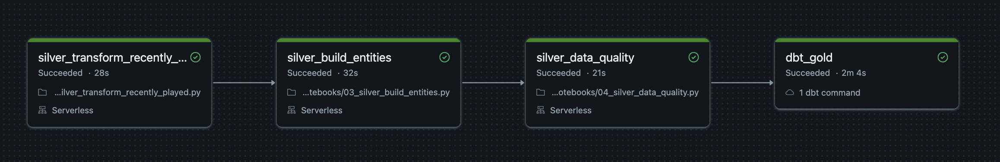
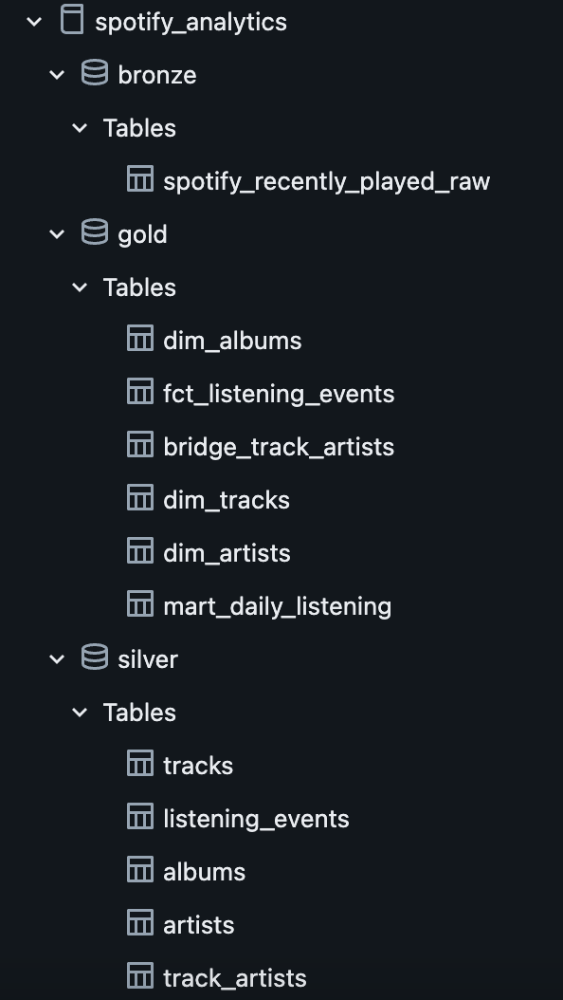
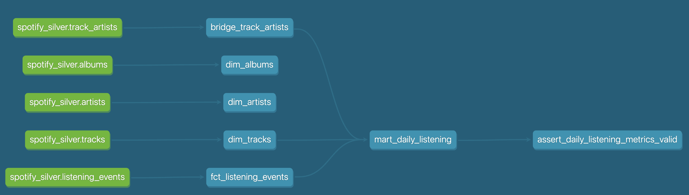

# Spotify Listening Analytics

An end-to-end analytics engineering project that collects personal Spotify listening activity and transforms raw API responses into tested, analytics-ready datasets using Python, Databricks, PySpark, Delta Lake, dbt, and Databricks Lakeflow Jobs.

The project demonstrates a modern analytics engineering workflow including incremental ingestion, medallion architecture, nested JSON processing, dimensional modeling, data quality validation, dbt testing, and workflow orchestration.

## Architecture

```text
Spotify Web API
       │
       ▼
Python / Spotipy
Incremental ingestion
       │
       ▼
Databricks Bronze
Raw API responses
       │
       ▼
PySpark
Parse • Explode • Deduplicate
       │
       ▼
Databricks Silver
Clean events and reusable entities
       │
       ▼
Silver Data Quality
Uniqueness • Completeness • Referential integrity
       │
       ▼
dbt
       │
       ▼
Databricks Gold
Facts • Dimensions • Bridge tables • Analytics marts
       │
       ▼
Analytics-ready datasets

## Data Model

The pipeline separates source-oriented Silver models from analytics-oriented Gold models.

### Silver Layer

The Silver layer represents cleaned and reusable Spotify entities.

| Table | Grain | Purpose |
|---|---|---|
| `listening_events` | One row per unique track play | Clean, deduplicated listening history |
| `tracks` | One row per Spotify track | Reusable track metadata |
| `albums` | One row per Spotify album | Reusable album metadata |
| `artists` | One row per Spotify artist | Reusable artist metadata |
| `track_artists` | One row per track-artist relationship | Resolves the many-to-many relationship between tracks and artists |

### Gold Layer

The Gold layer is modeled for analytical consumption using dbt.

| Model | Grain | Purpose |
|---|---|---|
| `fct_listening_events` | One row per listening event | Core listening activity fact table |
| `dim_tracks` | One row per track | Track-level descriptive attributes |
| `dim_albums` | One row per album | Album-level descriptive attributes |
| `dim_artists` | One row per artist | Artist-level descriptive attributes |
| `bridge_track_artists` | One row per track-artist relationship | Connects tracks to one or more artists |
| `mart_daily_listening` | One row per listening date | Business-facing daily listening metrics |

### Gold Relationships

```text
                         dim_albums
                             ▲
                             │ album_id
                             │
fct_listening_events ─────► dim_tracks
         │                   │
         │                   │ track_id
         │                   ▼
         │            bridge_track_artists
         │                   │
         │                   │ artist_id
         │                   ▼
         │              dim_artists
         │
         └── event-level listening activity


fct_listening_events
         │
         │ aggregated by date
         ▼
mart_daily_listening

## Key Engineering Decisions

### Preserve Raw Spotify Responses in Bronze

Spotify API responses are stored in Bronze as complete JSON payloads rather than immediately flattened.

Each Bronze record contains:

- `batch_id`
- `ingested_at`
- `source_endpoint`
- raw `payload`

This preserves the original source data and allows downstream models to be rebuilt if transformation requirements change.

---

### Explicit Grain at Every Layer

Each dataset has a clearly defined grain.

Examples:

- Bronze recently played data: one row per API extraction response
- Silver `listening_events`: one row per track play
- Silver `tracks`: one row per track
- Gold `fct_listening_events`: one row per listening event
- Gold `mart_daily_listening`: one row per listening date

Explicit grain definitions help prevent accidental duplication and incorrect aggregations.

---

### Nested JSON Processing with PySpark

Spotify returns nested structures containing tracks, albums, artists, and playback context.

PySpark is used to:

1. Parse raw JSON
2. Convert nested JSON into typed Spark structures
3. Explode the listening-event array
4. Flatten relevant attributes
5. Preserve multi-valued artist relationships

This converts semi-structured API data into reusable analytical entities.

---

### Deterministic Listening Event IDs

Spotify does not provide a unique identifier for each individual track play.

A deterministic `listening_event_id` is therefore generated from:

`track_id + played_at`

using SHA-256 hashing.

The same listening event produces the same identifier across ingestion runs, allowing duplicate events from overlapping API responses to be detected reliably.

---

### Overlapping API Pulls and Idempotency

Incremental ingestion uses the latest successfully processed `played_at` timestamp as its checkpoint.

API responses can still overlap between runs.

Rather than requiring Bronze to be duplicate-free:

- Bronze preserves every API extraction
- Silver generates deterministic event IDs
- Silver deduplicates listening events

This allows the pipeline to safely reprocess overlapping source data without multiplying analytical records.

---

### Many-to-Many Track and Artist Relationships

A Spotify track may contain multiple artists.

Directly joining artists into the listening-event fact table could create fan-out:

```text
1 listening event
      ↓
2 artists
      ↓
2 resulting rows

## Analytical Outputs

The Gold layer includes a business-facing daily listening mart:

`gold.mart_daily_listening`

**Grain:** One row per calendar date with recorded listening activity.

### Metrics

| Metric | Definition |
|---|---|
| `total_plays` | Number of listening events recorded on the date |
| `unique_tracks` | Number of distinct tracks played |
| `unique_artists` | Number of distinct artists represented |
| `listening_minutes` | Approximate potential listening time based on track durations |
| `repeat_plays` | Plays where the same track had already been played earlier that day |
| `repeat_play_rate` | Repeat plays divided by total plays |
| `explicit_plays` | Number of plays involving tracks marked explicit by Spotify |
| `first_played_at` | Earliest recorded listening event of the day |
| `last_played_at` | Latest recorded listening event of the day |

### Metric Caveat

`listening_minutes` is calculated from the full duration of tracks recorded as played.

Spotify's Recently Played data does not indicate whether a track was played to completion, so this metric represents **potential listening duration rather than exact listening time**.

### Example Analytical Questions

The modeled data can answer questions such as:

- How does listening activity change day to day?
- How many unique tracks and artists are consumed each day?
- How repetitive or exploratory is daily listening behavior?
- Which tracks are repeatedly played within the same day?
- Which artists account for the largest share of listening activity?
- How does listening behavior vary by time of day?
- How does the mix of unique versus repeated tracks change over time?
- Which albums and artists appear most frequently in listening history?

### Example Gold Query

```sql
select
    played_date,
    total_plays,
    unique_tracks,
    unique_artists,
    listening_minutes,
    repeat_play_rate
from spotify_analytics.gold.mart_daily_listening
order by played_date desc;

## Setup and Reproducibility

### Prerequisites

To run the project, you need:

* Python 3
* Git
* A Spotify developer application
* A Databricks workspace with Unity Catalog
* Databricks CLI
* Access to a Databricks SQL warehouse

The repository does not contain credentials, OAuth tokens, raw personal Spotify listening data, or local environment configuration.

### 1. Clone the Repository

```bash
git clone https://github.com/ShawnR2442/spotify-listening-analytics.git
cd spotify-listening-analytics
```

### 2. Create the Python Environment

```bash
python3 -m venv .venv
source .venv/bin/activate
pip install -r requirements.txt
```

### 3. Configure Local Environment Variables

Create a local `.env` file in the project root.

```text
SPOTIPY_CLIENT_ID=<spotify-client-id>
SPOTIPY_REDIRECT_URI=http://127.0.0.1:8888/callback

DATABRICKS_SERVER_HOSTNAME=<databricks-server-hostname>
DATABRICKS_HTTP_PATH=<sql-warehouse-http-path>
```

The `.env` file is excluded from Git.

Spotify OAuth tokens and other local authentication artifacts are also excluded from version control.

### 4. Configure Spotify

Create a Spotify Web API application and register the redirect URI:

```text
http://127.0.0.1:8888/callback
```

The ingestion process requires permission to read recently played Spotify activity.

### 5. Authenticate the Databricks CLI

Authenticate to the target Databricks workspace:

```bash
databricks auth login --host https://<databricks-workspace-host>
```

Verify the authenticated identity:

```bash
databricks current-user me
```

### 6. Validate the Databricks Bundle

The Databricks workflow is defined in:

```text
databricks.yml
resources/spotify_analytics_job.yml
```

Validate the configuration before deployment:

```bash
databricks bundle validate --target dev
```

### 7. Deploy the Pipeline

Deploy the notebooks, dbt project, and Lakeflow Job definition:

```bash
databricks bundle deploy --target dev
```

The Bundle deploys version-controlled project files into Databricks and manages the pipeline resource defined in `resources/spotify_analytics_job.yml`.

### 8. Ingest New Spotify Activity

Run the local incremental ingestion process:

```bash
python ingestion/ingest_recently_played.py
```

The ingestion script:

1. Reads the latest successfully processed listening timestamp.
2. Requests newer recently-played activity from Spotify.
3. Preserves API responses in the Databricks Bronze layer.
4. Allows overlapping source batches while downstream Silver processing handles event deduplication.

### 9. Run the Transformation Pipeline

After Bronze ingestion, execute the orchestrated pipeline:

```bash
databricks bundle run --target dev Spotify_Analytics_Pipeline
```

The workflow executes:

```text
silver_transform_recently_played
              ↓
silver_build_entities
              ↓
silver_data_quality
              ↓
dbt_gold
```

The Gold build executes only if the Silver data-quality task succeeds.

### Optional: Local dbt Development

For local development of Gold models, activate the project's Python environment:

```bash
source .venv/bin/activate
```

Configure a local dbt profile outside the repository at:

```text
~/.dbt/profiles.yml
```

Then test the connection:

```bash
dbt debug --project-dir dbt
```

Build the Gold layer locally:

```bash
dbt build --project-dir dbt --select gold
```

Local dbt credentials and connection profiles are intentionally not stored in the repository.

## Security and Version Control

The following files and directories are excluded from Git:

```text
.env
.venv/
.spotify_cache
data/raw/
dbt/target/
dbt/logs/
dbt/dbt_packages/
.DS_Store
```

This keeps credentials, authentication artifacts, generated files, local environments, and personal Spotify listening data out of the public repository.

## Pipeline in Action

### Orchestrated Databricks Workflow

The Silver transformation, entity modeling, data-quality validation, and dbt Gold build are executed as a dependency-managed Databricks Lakeflow Job.



A critical Silver data-quality failure prevents the downstream dbt Gold task from executing.

### Databricks Medallion Architecture

Raw Spotify responses progress through Bronze, Silver, and Gold schemas within the Databricks lakehouse.



### dbt Lineage

dbt manages the analytical Gold layer and captures dependencies between Silver sources, dimensional models, fact tables, bridge tables, and analytical marts.

